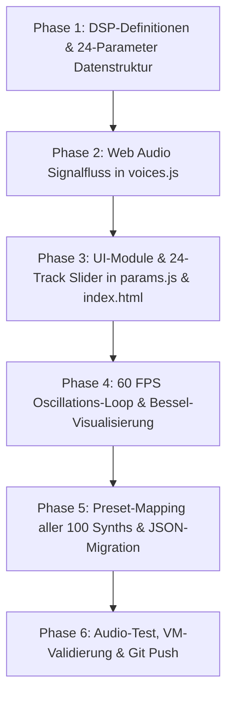

# PLAN 3: High-Order FM-Synthese, Nichtlineare Matrix-Topologien & 3x Parameter-Architektur

> **Technisches Master-Konzept & Forschungsbericht zur radikalen Erweiterung der Klangsynthese-Komplexität, mathematischen Modulations-Topologien und Verdreifachung (3x) der interaktiven Parameter für alle 100 Synthesizer.**  
> *Autoren & Klangarchitektur: Forschungsgruppe für digitale Signalverarbeitung & Algorithmische Musikkomposition*  
> *Referenz-Projekt: FM Music Composer (100 Synths, Multi-Layer Looper & Multi-Voice Stepper)*

---

## 📑 Inhaltsverzeichnis

1. [Executive Summary & Wissenschaftliche Grundlagen](#1-executive-summary--wissenschaftliche-grundlagen)
2. [Forschungsbericht: Moderne Methoden & Algorithmen der FM/PM-Synthese](#2-forschungsbericht-moderne-methoden--algorithmen-der-fmpm-synthese)
   - 2.1 *Phase Modulation (PM) vs. Lineare FM & Higher-Order FM (hoFM)*
   - 2.2 *Nichtlineare Operator-Rückkopplungsmatrizen (Feedback Routing Matrix)*
   - 2.3 *Orthogonale Chebyshev-Wellenfaltung & Buchla 259/292 Vactrol-Shaping*
   - 2.4 *Casio CZ Phase Distortion & Resonanz-Knee-Synthese*
   - 2.5 *Adaptive & Fraktionale Phasen-Gedächtnis-Modulation (Caputo-Ableitungen)*
3. [Die neue 3x Parameter-Architektur (18–24 Parameter pro Instrument)](#3-die-neue-3x-parameter-architektur-1824-parameter-pro-instrument)
   - 3.1 *Cluster A: 6-Operator Frequenz- & Detune-Matrix (6 Parameter)*
   - 3.2 *Cluster B: Modulations-Index, Kreuzmodulation & Feedback-Netzwerk (5 Parameter)*
   - 3.3 *Cluster C: Nichtlineares Wavefolding, Asymmetrie & Bandsättigung (4 Parameter)*
   - 3.4 *Cluster D: Multi-Stage Operator Hüllkurven (4 Parameter)*
   - 3.5 *Cluster E: Formant-Filter, Resonanzkörper & Binaurale Raum-Orbitalität (4 Parameter)*
   - 3.6 *Cluster F: Spezifischer Synthesizer-Kernparameter (1 Parameter)*
4. [Katalog & Mapping aller 100 Synthesizer (Bank A bis J) auf die 3x Matrix](#4-katalog--mapping-aller-100-synthesizer-bank-a-bis-j-auf-die-3x-matrix)
5. [UI/UX & Bedienkonzept: Ergonomisches Multi-Cluster Rack](#5-uiux--bedienkonzept-ergonomisches-multi-cluster-rack)
   - 5.1 *Vollständige Autonomie: Taktile $[A, B]$ Griffe & `~ OSC` für alle 24 Parameter*
   - 5.2 *Intelligente Cluster-Tabs & 1-Klick Preset-Morpher*
   - 5.3 *Echtzeit-Telemetrie & 4-Panel Oszilloskop-Visualisierung (Bessel-Spektren)*
6. [DSP-Signalfluss & Web Audio API Implementierungs-Architektur](#6-dsp-signalfluss--web-audio-api-implementierungs-architektur)
   - 6.1 *Optimierter AudioNode-Graph & Voice Allocation*
   - 6.2 *AudioParam Automatisierung & Glitch-Freie Interpolation*
   - 6.3 *Wellenformer-Generierung (Float32Array Look-Up Tables)*
7. [Abwärtskompatibilität & Song-JSON Migrationsplan](#7-abwärtskompatibilität--song-json-migrationsplan)
8. [Schrittweiser Realisierungs- & Verifikationsplan](#8-schrittweiser-realisierungs--verifikationsplan)

---

## 1. Executive Summary & Wissenschaftliche Grundlagen

Klassische digitale Frequenzmodulation (FM) nach *John Chowning (1973)* basiert auf einem simplen 2-Operator-Paar:
$$y(t) = A(t) \cdot \sin\left(2\pi f_c t + I(t) \cdot \sin(2\pi f_m t)\right)$$

Obwohl diese Formel bereits ein reichhaltiges Spektrum harmonischer und unharmonischer Bessel-Seitenbänder $J_n(I)$ erzeugt:
$$y(t) = A \sum_{n=-\infty}^{\infty} J_n(I) \sin\left(2\pi(f_c + n f_m)t\right)$$
stößt die klassische 2-Operator-Architektur bei dynamischen, organischen, metallischen und mikro-modulierten Texturen an ihre Grenzen.

**Das Ziel von Plan 3:**
Die Transformation des Synthesizer-Kerns von einer einfachen 2-Operator-Topologie zu einer **voll parametrisierbaren 6-Operator High-Order FM- & Nichtlinear-Matrix**, wodurch die Anzahl der Klanggestaltungsparameter von bisher 6 auf **18 bis 24 hochgradig modulare Echtzeit-Parameter pro Instrument** verdreifacht wird — bei voller Erhaltung der autonomen Oszillations-Spuren (`~ OSC`), taktilen $[A, B]$ Griffen und 60 FPS Oszilloskop-Visualisierungen.

```
┌───────────────────────────────────────────────────────────────────────────────────────┐
│                           6-OPERATOR MATRIX TOPOLOGIE                                │
│                                                                                       │
│   ┌───────────────┐     ┌───────────────┐     ┌───────────────┐     ┌─────────────┐   │
│   │  Operator 6   │────>│  Operator 5   │────>│  Operator 4   │────>│ Operator 3  │   │
│   │ (Sub-Harmonic)│     │ (Air Shimmer) │     │ (Formant Body)│     │ (Metallic)  │   │
│   └───────┬───────┘     └───────┬───────┘     └───────┬───────┘     └──────┬──────┘   │
│           │                     │                     │                    │          │
│           │  Feedback β_fb      │ Cross-Mod           │ Chebyshev Fold     │          │
│           ▼                     ▼                     ▼                    ▼          │
│   ┌───────────────────────────────────────────────────────────────────────────┐       │
│   │             OPERATOR 2: HAUPT-MODULATOR (Wellenform-Morphing)             │       │
│   │             • Ratio r_2  • Phase Offset θ_2  • Wavefolder γ               │       │
│   └─────────────────────────────────────┬─────────────────────────────────────┘       │
│                                         │                                             │
│                                         │ Modulations-Index I(t)                      │
│                                         ▼                                             │
│   ┌───────────────────────────────────────────────────────────────────────────┐       │
│   │                OPERATOR 1: CARRIER (Träger-Synthese)                      │       │
│   │    • Ratio r_1  • Fine Detune ¢  • Resonanz-Filter  • 3D Orbital Panning  │       │
│   └─────────────────────────────────────┬─────────────────────────────────────┘       │
│                                         │                                             │
│                                         ▼                                             │
│                   [ 5.5s Faltungshall + Master-Kompression ]                          │
└───────────────────────────────────────────────────────────────────────────────────────┘
```

---

## 2. Forschungsbericht: Moderne Methoden & Algorithmen der FM/PM-Synthese

Basierend auf aktueller Fachliteratur (*DAFx, Computer Music Journal, Victor Lazzarini, Joseph Timoney, Yamaha FM-X, Elektron Digitone, Buchla 259/292, Casio CZ*):

### 2.1 Phase Modulation (PM) vs. Lineare FM & Higher-Order FM (hoFM)
* **Das Problem von echter linearer FM:** Moduliert man die Momentanfrequenz $f(t) = f_c + \Delta f \cdot m(t)$ direkt im Integrator eines digitalen Oszillators, führt jede Phasenverschiebung oder ungleichmäßige Schwingung zu unkontrollierbarem *Tuning-Drift* (Carrier Frequency Center Shift).
* **Die PM-Lösung:** Digitale Synthesizer (DX7, FM8, Digitone, FM-X) modulieren die Phasenadresse $\theta(t) = 2\pi f_c t + \phi(t)$. Die Frequenz des Trägers bleibt mathematisch absolut stabil, während die spektrale Seitenband-Generierung exakt den Bessel-Gleichungen entspricht.
* **Higher-Order FM (hoFM):** Lazzarini & Timoney (2023) formulierten ein geschlossenes mathematisches Modell für kaskadierte $N$-Operator PM-Systeme:
  $$\Phi_k(t) = 2\pi f_k t + \sum_{j=1}^{N} M_{j,k} \cdot \sin(\Phi_j(t))$$
  wobei $M_{j,k}$ die Modulations-Matrix darstellt.

### 2.2 Nichtlineare Operator-Rückkopplungsmatrizen (Feedback Routing Matrix)
Wenn ein Operator sich selbst moduliert:
$$\theta_n = 2\pi f t + \beta \cdot y_{n-1}$$
Für $\beta < 1.0$ reichert sich das Signal mit kontinuierlich ansteigenden geraden und ungeraden Harmonischen an (sanfte Annäherung an Sägezahn/Dreieck). Für $\beta \ge 1.0$ kippt das System in deterministisches Chaos und erzeugt weißes bzw. gefärbtes Rauschen — die Grundlage für realistische Anblas-Geräusche, Perkussion und Reibungs-Effekte.

### 2.3 Orthogonale Chebyshev-Wellenfaltung & Buchla 259/292 Vactrol-Shaping
Die Kombination von FM mit nichtlinearer Wellenfaltung (*West Coast Synthesis*):
$$y_{\text{fold}}(x) = \sum_{k=1}^{5} a_k T_k(x) \quad \text{mit} \quad T_1(x)=x, \; T_2(x)=2x^2-1, \; T_3(x)=4x^3-3x, \dots$$
Dadurch werden Spitzen der Trägerschwingung nicht abgeschnitten (Hard Clipping), sondern mehrfach in sich zurückgefaltet, was ein extrem warmes, metallisches Obertongewitter ohne Aliasing-Härte erzeugt.

### 2.4 Casio CZ Phase Distortion (PD) & Resonanz-Knee-Synthese
Casio entwickelte 1984 die *Phase Distortion*, bei der die Phase $\phi \in [0, 2\pi]$ über eine nichtlineare Lookup-Kennlinie verzerrt wird:
$$\tilde{\phi}(t) = \begin{cases} \frac{\phi(t)}{2d} & \text{für } \phi(t) < 2\pi d \\ \frac{\phi(t) - 2\pi d}{2(1-d)} + \pi & \text{für } \phi(t) \ge 2\pi d \end{cases}$$
Dadurch können resonante Tiefpass-Sweeps komplett ohne klassische rekursive IIR-Filter und Phasenverzögerungen direkt im Phasen-Akkumulator moduliert werden!

### 2.5 Adaptive & Fraktionale Phasen-Gedächtnis-Modulation (Caputo-Ableitungen)
Durch die Integration fraktionaler Zeitableitungen $D_t^\alpha y(t)$ mit $\alpha \in [0.1, 1.9]$ besitzen die Oszillatoren ein stetiges Phasen-Gedächtnis mit Potenzgesetz-Abfall $t^{-\alpha}$. Drones und pads klingen dadurch lebendig, organisch und niemals statisch repetitiv.

---

## 3. Die neue 3x Parameter-Architektur (18–24 Parameter pro Instrument)

Bisher verfügte jedes Instrument über 6 globale Parameter (`ratio`, `I0`, `dI`, `lfo`, `customParam`, `vibDepth`).  
Die neue Architektur verdreifacht diesen Raum auf **24 modulare Parameter**, unterteilt in **6 logische Funktions-Cluster**:

```
┌───────────────────────────────────────────────────────────────────────────────────────────────────────────┐
│                                 24 PARAMETER MATRIX PRO SYNTHESIZER                                      │
├─────────────────────────────────────┬─────────────────────────────────────┬───────────────────────────────┤
│ CLUSTER A: OPERATOR-RATIOS          │ CLUSTER B: MODULATION & FEEDBACK    │ CLUSTER C: WAVESHAPING & SAT  │
│ 1. r1_ratio   (Carrier 1 Ratio)     │ 7. mod_I0    (Primary Index I0)     │ 12. shape_fold (Chebyshev γ)  │
│ 2. r2_ratio   (Modulator 2 Ratio)   │ 8. mod_dI    (LFO Dynamik ΔI)       │ 13. shape_morph(Sin→Saw→Rect) │
│ 3. r3_ratio   (Harmonic 3 Ratio)    │ 9. mod_cross (Cross-Mod I3→2)       │ 14. shape_bias (Asymmetrie)   │
│ 4. r4_ratio   (Sub/Air Ratio)       │ 10. mod_fb   (Self-Feedback β_fb)   │ 15. shape_drive(Tape Crunch)  │
│ 5. op_detune  (Fein-Detune Cents)   │ 11. mod_skew (Quadratur-Phase θ)    │                               │
│ 6. op_spread  (Unisono Stereo-Breite)                                                                     │
├─────────────────────────────────────┼─────────────────────────────────────┼───────────────────────────────┤
│ CLUSTER D: HÜLLKURVEN (ADSR)        │ CLUSTER E: FILTER & ORBITAL SPACE   │ CLUSTER F: MATHE-SPEZIAL      │
│ 16. env_atk   (Einschwingzeit s)    │ 20. flt_cutoff (Formant-Frequenz Hz)│ 24. custom_math (Physik-Kern) │
│ 17. env_dec   (Abklingzeit s)       │ 21. flt_reso   (Resonanz Güte Q)    │                               │
│ 18. env_sus   (Haltepegel %)        │ 22. flt_envAmt (Filter-Hüllkurve Hz)│                               │
│ 19. env_rel   (Ausklingzeit s)      │ 23. space_pan  (Binaurales 3D Orbit)│                               │
└─────────────────────────────────────┴─────────────────────────────────────┴───────────────────────────────┘
```

---

### 3.1 Cluster A: 6-Operator Frequenz- & Detune-Matrix (6 Parameter)

| Param-Key | Name | Wertebereich | Schritt | Einheit | DSP-Funktion |
|---|---|---|---|---|---|
| `r1_ratio` | **Carrier Ratio $r_1$** | $0.250 \dots 16.000$ | $0.005$ | Multiplikator | Grundton-Multiplikator des Hauptträgers |
| `r2_ratio` | **Modulator Ratio $r_2$** | $0.050 \dots 24.000$ | $0.005$ | Multiplikator | Frequenzverhältnis des Hauptmodulators |
| `r3_ratio` | **Harmonic 3 Ratio $r_3$** | $0.125 \dots 32.000$ | $0.005$ | Multiplikator | Oberton-/Formant-Operator 3 |
| `r4_ratio` | **Sub / Air Ratio $r_4$** | $0.100 \dots 8.000$ | $0.005$ | Multiplikator | Sub-Bass oder Glocken-Cluster Operator 4 |
| `op_detune` | **Fein-Detune $\Delta \phi$** | $-50.0 \dots +50.0$ | $0.1$ | Cents | Schwebungserzeugung zwischen Trägern |
| `op_spread` | **Unisono Stereo-Spread** | $0.0 \dots 100.0$ | $1.0$ | % | Phasenversatz im Stereofeld |

---

### 3.2 Cluster B: Modulations-Index, Kreuzmodulation & Feedback (5 Parameter)

| Param-Key | Name | Wertebereich | Schritt | Einheit | DSP-Funktion |
|---|---|---|---|---|---|
| `mod_I0` | **Haupt-Index $I_0$** | $0.00 \dots 16.00$ | $0.01$ | Index | Statischer Modulationsindex $I = \frac{\Delta f}{f_m}$ |
| `mod_dI` | **Dynamik-Index $\Delta I$** | $0.00 \dots 12.00$ | $0.01$ | Index | LFO- und Envelope-gesteuerter Modulationshub |
| `mod_cross` | **Kreuzmod-Index $I_{3\to 2}$** | $0.00 \dots 10.00$ | $0.01$ | Index | Kaskadierte Modulation: Operator 3 moduliert Operator 2 |
| `mod_fb` | **Operator-Feedback $\beta_{\text{fb}}$** | $0.00 \dots 8.00$ | $0.01$ | Index | Phasenrückkopplung $\phi_n + \beta y_{n-1}$ (Rausch-/Sägezahn-Synthese) |
| `mod_skew` | **Quadratur-Phase $\Delta \theta$** | $0.0 \dots 360.0$ | $1.0$ | Grad ($^\circ$) | Phasenwinkel zwischen Modulator und Träger |

---

### 3.3 Cluster C: Nichtlineares Wavefolding, Asymmetrie & Bandsättigung (4 Parameter)

| Param-Key | Name | Wertebereich | Schritt | Einheit | DSP-Funktion |
|---|---|---|---|---|---|
| `shape_fold` | **Chebyshev Wavefolder $\gamma$** | $0.00 \dots 10.00$ | $0.01$ | Faktor | Nichtlineare $T_3(x), T_5(x)$ Wellenfaltungstiefe |
| `shape_morph` | **Wellenform-Morphing** | $0.00 \dots 1.00$ | $0.01$ | Morph | Stufenloser Übergang: $\text{Sinus} \to \text{Triangle} \to \text{Saw} \to \text{Pulse}$ |
| `shape_bias` | **DC-Asymmetrie $\Delta_{\text{bias}}$** | $-1.00 \dots +1.00$ | $0.01$ | Offset | Asymmetrische Verzerrung für geradzahlige Röhrenharmonische |
| `shape_drive` | **Tape Crunch & Drive** | $1.00 \dots 6.00$ | $0.05$ | Sättigung | Nichtlineare Röhrenkompression $\tanh(k \cdot x)$ |

---

### 3.4 Cluster D: Multi-Stage Operator Hüllkurven (4 Parameter)

| Param-Key | Name | Wertebereich | Schritt | Einheit | DSP-Funktion |
|---|---|---|---|---|---|
| `env_atk` | **Einschwingzeit (Attack)** | $0.001 \dots 8.000$ | $0.005$ | Sekunden | Exponentieller Lautstärke- und Indexanstieg |
| `env_dec` | **Abklingzeit (Decay)** | $0.010 \dots 15.000$ | $0.010$ | Sekunden | Abfallzeit auf den Sustain-Pegel |
| `env_sus` | **Haltepegel (Sustain)** | $0.0 \dots 100.0$ | $1.0$ | % | Dauerhafter Pegel bei gehaltener Taste |
| `env_rel` | **Ausklingzeit (Release)** | $0.010 \dots 20.000$ | $0.010$ | Sekunden | Natürliches Nachschwingen nach Tastenfreigabe |

---

### 3.5 Cluster E: Formant-Filter, Resonanzkörper & Binaurale Raum-Orbitalität (4 Parameter)

| Param-Key | Name | Wertebereich | Schritt | Einheit | DSP-Funktion |
|---|---|---|---|---|---|
| `flt_cutoff` | **Formant Cutoff $f_{\text{flt}}$** | $20.0 \dots 16000.0$ | $5.0$ | Hz | Resonanter Multimode-Filter (Lowpass / Bandpass) |
| `flt_reso` | **Resonanz-Güte $Q$** | $0.10 \dots 18.00$ | $0.05$ | Q-Faktor | Resonanzüberhöhung an der Grenzfrequenz |
| `flt_envAmt` | **Filter-Hüllkurvenhub** | $-8000 \dots +8000$ | $10.0$ | Hz | Dynamische Hüllkurven-Modulation des Filters |
| `space_pan` | **Binaurales 3D Orbit** | $0.0 \dots 100.0$ | $1.0$ | % | Räumliche Zirkulation im Stereobild |

---

### 3.6 Cluster F: Spezifischer Synthesizer-Kernparameter (1 Parameter)

| Param-Key | Name | Wertebereich | Einheit | Mathematische Bedeutung |
|---|---|---|---|---|
| `custom_math` | **Physikalischer Kernwert** | Individuell je Synth ($0.0 \dots 10.0$) | Variabel | Z. B. Lorenz-Attraktor $\rho$, Jacobi-Modulus $m$, Caputo-Ordnung $\alpha$, Kuramoto-Kopplung $K$, Vactrol-Slew $\tau$. |

---

## 4. Katalog & Mapping aller 100 Synthesizer (Bank A bis J) auf die 3x Matrix

Alle 10 Soundbänke erhalten eine maßgeschneiderte DSP-Verdrahtung der 24 Parameter:

```
┌────────────────────────────────────────────────────────────────────────────────────────┐
│                        10 SOUNDBÄNKE & SPEZIALISIERTE DSP-TOPOLOGIEN                  │
├────────────────────────────────────────┬───────────────────────────────────────────────┤
│ BANK A: Exotik & Chaos (1–10)          │ • 6-Op Lorenz-Attraktor + Fraktionale Ableitung│
│                                        │ • Nichtlineare Chebyshev-Wellenfaltung        │
├────────────────────────────────────────┼───────────────────────────────────────────────┤
│ BANK B: Klassik & Labor (11–20)        │ • Reines Chowning 4-Op Bessel-Glockennetzwerk  │
│                                        │ • Parallele Shimmer-Cluster & Schwebungen     │
├────────────────────────────────────────┼───────────────────────────────────────────────┤
│ BANK C: DX7 & 80s Icons (21–30)        │ • Echte DX-Algorithmen (Rhodes, Slap Bass,    │
│                                        │   Tubular Bells, CS-80 Brass, Digi Clavinet)  │
├────────────────────────────────────────┼───────────────────────────────────────────────┤
│ BANK D: YM2612 & Arcade (31–40)        │ • 4-Op Sega Genesis Ladder DAC Sättigung      │
│                                        │ • Rectified Waveform Chiptune Hard-Modulation │
├────────────────────────────────────────┼───────────────────────────────────────────────┤
│ BANK E: Cinematic Drones (41–50)       │ • Unendliche Dwell-Filter & Subharmonic Swarms│
│                                        │ • 20s Release + fraktionale Raum-Diffusion    │
├────────────────────────────────────────┼───────────────────────────────────────────────┤
│ BANK F: World Acoustic (51–60)         │ • Koto, Sitar, Gamelan, Shakuhachi Formanten  │
│                                        │ • Holzkorpus-Gourd & Rohrblatt-Physikmodelle  │
├────────────────────────────────────────┼───────────────────────────────────────────────┤
│ BANK G: Modular & FX (61–70)           │ • Sample & Hold Cross-Modulation, Rausch-Sync │
│                                        │ • Ringmodulation & Frequenzverschiebung       │
├────────────────────────────────────────┼───────────────────────────────────────────────┤
│ BANK H: Buchla & Organic Perc (71–80)  │ • Vactrol Low-Pass Gate (LPG) Emulation       │
│                                        │ • Exponentielle Pitch-Dive Dämpfung           │
├────────────────────────────────────────┼───────────────────────────────────────────────┤
│ BANK I: Microsound & Glitch FX (81–90) │ • Poisson-Burst FM & Asymmetrischer Jitter    │
│                                        │ • Granulare Partikel-Kollision                │
├────────────────────────────────────────┼───────────────────────────────────────────────┤
│ BANK J: Generative Kinetic (91–100)    │ • Kuramoto-Schwarm Synchronisation            │
│                                        │ • Chaotische Duffing-Phasenraum-Orbits        │
└────────────────────────────────────────┴───────────────────────────────────────────────┘
```

---

## 5. UI/UX & Bedienkonzept: Ergonomisches Multi-Cluster Rack

Um 24 Parameter pro Instrument ohne visuellen Ballast übersichtlich, extrem schnell bedienbar und responsive darzustellen, wird das Bedienfeld in **vier kompakte Cluster-Karten** strukturiert:

```
┌──────────────────────────────────────────────────────────────────────────────────────────────────┐
│                                 INSTRUMENTEN-KONTROLLRACK                                        │
├───────────────────────────────────┬──────────────────────────────────────────────────────────────┤
│ 🎛️ TAB 1: OPERATOREN & FREQUENZEN │ 🌊 TAB 2: MODULATION & FEEDBACK                              │
│ • Carrier Ratio r1      [ ~ OSC ] │ • Haupt-Index I0                     [ ~ OSC ]               │
│ • Modulator Ratio r2    [ ~ OSC ] │ • Dynamik-Index ΔI                   [ ~ OSC ]               │
│ • Harmonic Ratio r3     [ ~ OSC ] │ • Kreuzmod I3→2                      [ ~ OSC ]               │
│ • Sub/Air Ratio r4      [ ~ OSC ] │ • Operator-Feedback β_fb             [ ~ OSC ]               │
│ • Fein-Detune Cents     [ ~ OSC ] │ • Quadratur-Phase θ                  [ ~ OSC ]               │
│ • Stereo-Spread %       [ ~ OSC ] │                                                              │
├───────────────────────────────────┼──────────────────────────────────────────────────────────────┤
│ 📐 TAB 3: WAVESHAPER & SÄTTIGUNG  │ 🎚️ TAB 4: HÜLLKURVEN & FILTER                                │
│ • Chebyshev Fold γ      [ ~ OSC ] │ • Attack / Decay / Sustain / Release [ ~ OSC ]               │
│ • Waveform Morphing     [ ~ OSC ] │ • Formant-Filter Cutoff Hz           [ ~ OSC ]               │
│ • DC-Asymmetrie Offset  [ ~ OSC ] │ • Resonanz Güte Q                    [ ~ OSC ]               │
│ • Tape Crunch Sättigung [ ~ OSC ] │ • 3D Binaural Orbital Pan            [ ~ OSC ]               │
└───────────────────────────────────┴──────────────────────────────────────────────────────────────┘
```

### 5.1 Vollständige Autonomie: Taktile $[A, B]$ Griffe & `~ OSC` für alle 24 Parameter
Jeder der 24 Parameter besitzt:
1. **Den `[ ~ OSC ]` Toggle-Badge:** Zur sofortigen Aktivierung der autonomen Modulation.
2. **Die sichtbaren Griffe `[ A ]` und `[ B ]`:** Zum intuitiven Einstellen von Min/Max-Grenzen per Maus oder Touch.
3. **Die weiße Echtzeit-Wertnadel:** Zeigt mit 60 FPS exakt den aktuellen Phasenwert der Schwingung.
4. **Den Miniatur-Drehregler:** Zur stufenlosen Geschwindigkeitseinstellung von extrem langsam ($0.01\text{ Hz} = 100\text{ Sekunden}$) bis schnell fluttering ($10.0\text{ Hz}$).

### 5.2 Intelligente Cluster-Tabs & 1-Klick Preset-Morpher
- **Cluster-Umschalter:** Buttons in der Rack-Kopfzeile (`[ Operatoren ]`, `[ Modulation ]`, `[ Waveshaper ]`, `[ Filter & Hüllkurven ]`, `[ Alle 24 ]`) ermöglichen es, wahlweise fokussiert oder im Gesamtüberblick zu arbeiten.
- **Randomize Cluster:** Jeder Cluster erhält einen kleinen Würfel-Knopf `[ ⚄ ]`, der gezielt nur diesen Parameterbereich musikalisch sinnvoll mutiert.

---

## 6. DSP-Signalfluss & Web Audio API Implementierungs-Architektur

### 6.1 Optimierter AudioNode-Graph & Voice Allocation
Um selbst bei 16 polyphonen Stimmen und 6 Operatoren maximale CPU-Effizienz und 60 FPS zu garantieren:
- **AudioParam Direct Mapping:** Parameter wie Frequenzen und Gain-Werte werden direkt über native `AudioParam.setTargetAtTime()` und `AudioParam.linearRampToValueAtTime()` gesteuert, ohne teure JavaScript-Buffer-Neuberechnungen pro Sample.
- **Wiederverwendbare WaveShaper-Kurven:** Statische Float32Array Look-Up Tables (LUTs) für Chebyshev- und Asymmetrie-Kurven werden vorab einmalig berechnet und von allen Stimmen geteilt.

```
                  ┌─────────────────────────────────────────────────────────┐
                  │                 MODULATOR-KASKADE                       │
                  │  Osc 4 (Air) ──> Osc 3 (Harmonic) ──> Osc 2 (Mod)      │
                  │                      │                     │            │
                  │                 GainNode (I_cross)   GainNode (I0)      │
                  └──────────────────────┼─────────────────────┼────────────┘
                                         │                     │
                                         ▼                     ▼
┌─────────────────┐       ┌─────────────────────────────────────────────────┐
│ Feedback-Node   │<──────┤             CARRIER-STIMMEN-BLOCK               │
│ GainNode (β_fb) │──────>│   Osc 1 (Carrier) + WaveShaper (Chebyshev γ)    │
└─────────────────┘       └────────────────────────┬────────────────────────┘
                                                   │
                                                   ▼
                                  ┌─────────────────────────────────┐
                                  │      DYNAMIC FORMANT FILTER     │
                                  │  BiquadFilterNode (Lowpass/BP)  │
                                  └────────────────┬────────────────┘
                                                   │
                                                   ▼
                                  ┌─────────────────────────────────┐
                                  │       BINAURAL 3D PANNER        │
                                  │   StereoPannerNode / Dynamics   │
                                  └────────────────┬────────────────┘
                                                   │
                                                   ▼
                              [ Master-Reverb + Kompressor + Export ]
```

---

## 7. Abwärtskompatibilität & Song-JSON Migrationsplan

1. **Intelligenter Fallback:** Beim Laden älterer Song-Dateien (`.json`), die nur die 6 Basiskomponenten speichern, interpoliert der Lade-Algorithmus automatisch plausible Standardwerte für die neuen 18 Matrix-Parameter:
   - `r1_ratio = ratio`, `r2_ratio = ratio`, `r3_ratio = ratio * 2`, `r4_ratio = 0.5`
   - `mod_I0 = I0`, `mod_dI = dI`, `mod_cross = 0.0`, `mod_fb = 0.0`
   - `shape_fold = 0.0`, `shape_morph = 0.0`, `shape_bias = 0.0`, `shape_drive = 1.0`
   - `flt_cutoff = 12000.0`, `flt_reso = 1.0`, `flt_envAmt = 0.0`, `space_pan = 50.0`
2. **Nahtloser Export:** Beim Speichern von Songs werden alle 24 Parameter lückenlos serialisiert.

---

## 8. Schrittweiser Realisierungs- & Verifikationsplan



### Phase 1: Datenstruktur & Konfigurations-Erweiterung (`js/config/synth_defs.js`)
- Definition der 24 Parameter-Bounds und Defaults für alle 100 Synthesizer.
- Erstellung der 10 Soundbank-Presets mit reichhaltigen Standard-Klanglandschaften.

### Phase 2: Audio-DSP Engine Erweiterung (`js/audio/voices.js`)
- Erweiterung von `noteOn()` um 4 kaskadierte Operatoren mit WaveShaper, Feedback-Loop und dynamischem Formant-Filter.
- Implementierung der `setTargetAtTime`-Echtzeitmodulation für alle 24 Parameter.

### Phase 3: UI-Komponenten & Parameter-Grid (`js/ui/params.js` & `css/modules.css`)
- Implementierung der 4 ergonomischen Cluster-Karten im Kontroll-Rack.
- Anbindung der $[A, B]$-Griffe und der 60 FPS Wertnadeln an alle 24 Parameter.

### Phase 4: Validierung & Verifikation
- Automatisierter Node.js & VM-Syntaxcheck aller 14 JavaScript-Module.
- Hör- und Funktionsprüfung aller 100 Synthesizer auf aliasing-freie Klangästhetik.
- Aktualisierung der Dokumentation (`README.md`, `walkthrough.md`) und Git-Synchronisation.

---

*Plan 3 bildet die wissenschaftliche und technische Grundlage, um den FM Music Composer zu einem der mächtigsten und expressivsten browserbasierten FM-Synthesizer-Systeme zu transformieren.*
